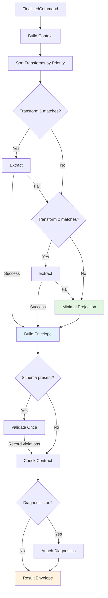

# Result Building – Conceptual Overview

> Status: Implemented. This pattern governs how raw API responses are transformed into stable, predictable results.
>
> Audience: Contributors and advanced users.
> Prerequisites: Familiarity with the Command Pipeline pattern and immutable data flow.

## Purpose & Scope

The Result Building pattern defines how `FinalizedCommand` objects (containing raw API responses) are transformed into stable, predictable result envelopes suitable for both single and batch requests. It ensures extraction is deterministic, observable, and resilient to model output variations while maintaining provider neutrality.

**In scope**:

- Pure extraction transforms with deterministic ordering
- Infallible fallback extraction
- Schema validation without failure
- Contract recording without enforcement
- Diagnostic observability
- Batch consistency and padding

**Not in scope**:

- I/O operations or SDK calls (handled by APIHandler)
- Retry logic or rate limiting (other handlers)
- Response generation or prompting (Planner)
- Streaming or multi-turn conversations

---

## Problem Statement

Large Language Models produce unpredictable output formats despite instructional prompts. The Result Builder must:

- **Extract answers deterministically** from varied formats (JSON, markdown, natural language)
- **Never fail** - always produce a valid result envelope
- **Maintain consistency** between single and batch requests
- **Record violations** without failing extraction
- **Stay provider-neutral** - no SDK dependencies
- **Enable observability** for quality monitoring

Traditional approaches either:

- Over-engineer with learning systems and confidence scoring (complexity)
- Under-engineer with rigid parsers that fail on variation (brittleness)

---

## Core Pattern

The Result Builder follows a **Two-Tier Transform Chain** with **record-only validation**:

```text
Raw Response → [Transform Chain] → [Minimal Fallback] → [Schema Wall] → Result Envelope
                     ↓                      ↓                ↓
              (first match wins)    (always succeeds)  (record only)
```

### Tier 1: Transform Chain

Ordered, pure extraction transforms that attempt to extract structured data. First successful match wins.

Built-in examples include:

- `batch_response` for vectorized container shapes (`{"batch": [...]}`)
- `json_array` for JSON arrays (including markdown-fenced)
- `provider_normalized` for common provider SDK shapes
- `markdown_list` for markdown lists
- `simple_text` for plain text

### Tier 2: Minimal Projection

Infallible fallback that always produces answers through progressive degradation:

1. Try JSON array parsing
2. Try numbered list extraction
3. Fall back to newline splitting
4. Ultimate fallback: return full text

### Schema Wall

Single validation pass that records violations without failing extraction. Provides observability into data quality. In addition, the builder records a pre-normalization answer-count mismatch warning to surface raw extraction fidelity before padding/truncation.

Note on answer-count fidelity: The contract validation operates on the normalized, post-padding/truncation answers. To retain fidelity to the originally extracted answers, the builder separately records a pre-normalization mismatch warning that compares the originally extracted answer count with the expected count. This ensures true extraction quality is observable even when the final envelope is normalized for downstream consistency.

---

## Conceptual Components

### TransformSpec

Pure extraction transform with three components:

- `matcher: Callable[[Any], bool]` - Predicate to test if transform applies
- `extractor: Callable[[Any, dict], dict]` - Pure function to extract answers
- `priority: int` - Explicit ordering (higher first)

### ExtractionContract

Record-only guarantees that never fail extraction:

- Expected answer count
- Min/max answer length
- Required fields
- Violations become telemetry, not errors

### MinimalProjection

The infallible fallback extractor that:

- Handles any input shape
- Attempts intelligent extraction
- Guarantees answer count through padding
- Never raises exceptions

### ExtractionDiagnostics

Optional observability providing:

- Attempted transforms
- Winning method
- Extraction duration
- Contract violations
- Transform errors (for debugging)
- Expected answer count and original (pre-normalization) answer count

---

## Design Principles

### Principle 1: Determinism Over Adaptation

No learning, no confidence scoring, no non-deterministic selection. Same input always produces same output.

### Principle 2: Record Don't Reject

Schema violations and contract breaches are recorded for observability but never cause extraction failure.

### Principle 3: Explicit Over Implicit

Transform priority is explicit. First match wins. No hidden scoring or ranking.

### Principle 4: Infallible Fallback

The minimal projection always succeeds, ensuring 100% extraction success rate.

---

## Quality Attributes

### Simplicity (5/5)

Two-tier model is "profoundly simple" - transforms with fallback. No hidden complexity.

### Robustness (5/5)

Cannot fail by design. Schema violations recorded but don't break extraction.

### Predictability (5/5)

Deterministic transform ordering. No learning or adaptation. Same input = same output.

### Observability (5/5)

Complete diagnostic trail when enabled. Violations tracked for quality monitoring.

### Performance (5/5)

O(n) guarantee. Single pass through transforms. Early exit on first match.

### Extensibility (5/5)

Add transforms without modifying core. Override with higher priority.

---

## Flow Diagram



---

## Integration Points

### With APIHandler

Receives `FinalizedCommand` containing raw API response. Never performs I/O or SDK calls.

### With Planner

Uses prompt count from `PlannedCommand` to determine expected answers and padding requirements.

### With Telemetry

Merges existing telemetry data. Adds extraction diagnostics when enabled.

### With Contract Tests

Provides stable result envelope shape for property-based testing.

---

## Examples

### JSON Array Extraction

```python
# Input
raw = {"text": '["Answer 1", "Answer 2"]'}

# Transform matches and extracts
# Output
{
    "status": "ok",
    "answers": ["Answer 1", "Answer 2"],
    "extraction_method": "json_array",
    "confidence": 0.95
}
```

### Fallback with Padding

```python
# Input (expects 3 answers, gets 1)
raw = {"text": "Single answer only"}

# Minimal projection + padding
# Output
{
    "status": "ok",
    "answers": ["Single answer only", "", ""],
    "extraction_method": "minimal_text",
    "confidence": 0.5
}
```

### Schema Violation Recording

```python
# Input with schema expecting specific fields
raw = {"text": '{"wrong": "shape"}'}

# Extraction succeeds, violations recorded
# Output
{
    "status": "ok",
    "answers": ['{"wrong": "shape"}'],
    "extraction_method": "minimal_text",
    "validation_warnings": [
        "Schema validation failed: ..."
    ]
}

Note: Confidence is required and validated in the core envelope validator.
Consumers can rely on `confidence` being present and within [0.0, 1.0].
```

---

## Related Documents

- [Deep Dive – Result Builder Spec](../deep-dives/result-builder-spec.md)
- [ADR-0005 – Two-Tier Result Builder](../decisions/ADR-0005-result-builder.md)
- [How-to – Custom Extraction Transforms](../../how-to/custom-transforms.md)
- [Architecture at a Glance](../architecture.md)
