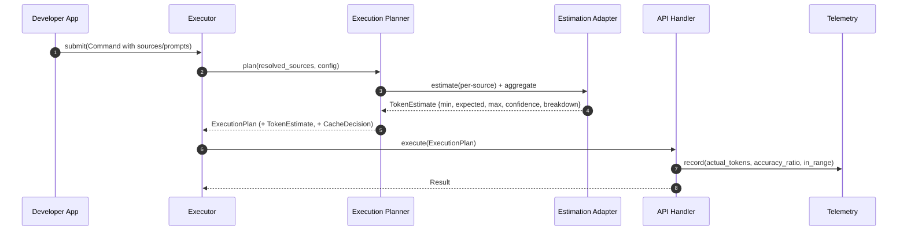

# Token Counting & Estimation – Conceptual Overview

> Status: Implemented on a separate branch. This page describes the final model adopted by ADR-0002; see planner and adapters.

## Purpose & Scope

This document explains how Pollux **estimates** token usage to support planning (batch sizing, caching decisions, and cost predictability). It is vendor-neutral by design and integrates cleanly with the Command Pipeline.

**In scope**:

- The problem this system solves and the design forces behind it
- The conceptual model (estimation adapters, uncertainty, planner integration)
- Policies for conservative decisions and vendor neutrality
- Observability and validation at execution time

**Not in scope**:

- API signatures or code (see deep dive)
- Step-by-step usage (see How-tos)
- Provider SDK mechanics (they are isolated to the API Handler)

---

## Problem Statement

The planner must decide *before execution* how to batch, whether to use caching, and whether a request risks exceeding model limits—**without** calling any provider SDK. Vendor token counters can be biased (content-type dependent), which leads to mis-sized batches, avoidable failures, or missed caching opportunities.

**Goals**:

- Provide **reliable, fast, SDK-free** estimates
- Make **uncertainty explicit** (ranges, not single numbers)
- Keep the planner **provider-agnostic**
- **Validate** estimates post-execution (observability), without coupling planning to execution

**Non-goals**:

- Real-time token tracking during streaming generation
- Sub-token precision
- Compensating for *every* vendor up front (adapters unlock this over time)

---

## Design Forces

- **Simplicity:** Estimation must remain small, pure, and testable.
- **Accuracy vs. speed:** Favor fast, conservative estimates with explicit uncertainty.
- **Isolation of concerns:** No SDK calls outside the API Handler.
- **Vendor neutrality:** Use **adapters** for provider-specific heuristics and bias compensation.
- **Determinism:** Same inputs → same estimate.
- **Observability:** Compare estimates vs. actuals to detect drift over time.

---

## Conceptual Model

### Core idea

A **pure estimation pipeline** that returns a **range** (`min`, `expected`, `max`) plus a **confidence** value. Provider-specific quirks and compensations live in **estimation adapters**.

```text
Sources & Prompts
↓
[ Estimation Adapter ]  —pure, deterministic, no SDK—
↓
TokenEstimate {min, expected, max, confidence, breakdown}
↓
[ Execution Planner ] → uses conservative policy (typically `max`)
```

### Roles

- **Estimation Adapter (vendor-specific):** Encapsulates heuristics and compensation (e.g., image/video bias). Multiple adapters can exist (Gemini, OpenAI, Anthropic), selected by model/provider.
- **TokenEstimate:** Conceptual data object capturing lower/expected/upper bounds and overall confidence; may include a per-source breakdown.
- **Execution Planner:** Consumes a **single** aggregate estimate to make decisions (batch sizing, cache eligibility, truncation policy).
- **API Handler (validation only):** Records actual usage after execution for telemetry/validation. It does **not** feed back into planning during the same run.

---

## Policies (conservative by construction)

> **Note on legacy iteration:** The first version wrapped `count_tokens()` with content-type adjustments and threshold buffers. It improved local accuracy but increased coupling and hidden policy. The new adapter-based estimator restores simplicity and testability while keeping conservative decisions.

- **Planning uses `max`** of the estimate to avoid cache misses and oversize batches.
- **Error tolerance:** Prefer slight over-estimation to under-estimation (safer batching).
- **Unknowns:** Unknown content types fall back to conservative byte-based heuristics with lower confidence.
- **Mixed content:** Confidence is reduced for heterogeneous batches, widening the range.

### Cache policy and floors (ADR‑0011)

Cache creation is governed by a small, explicit policy resolved from configuration and hints:

- **First‑turn‑only by default:** Shared cache creation is attempted only on the first turn (empty history). Later attempts are opt‑in via `CachePolicyHint(first_turn_only=False)`.
- **Confidence floor skip:** Skip creation when both are true: `estimate.max_tokens < floor` and `estimate.confidence ≥ conf_skip_floor` and `respect_floor=True`.
- **Floor resolution:** Prefer model capability thresholds (`explicit_minimum_tokens` → `implicit_minimum_tokens`), otherwise use 4096; override via `CachePolicyHint(min_tokens_floor=...)`.
- **Planner purity:** The planner applies this policy as a pure data transform. It does not call any provider SDK or read content.

---

## Data Flow (within the pipeline)



**Key constraint:** Estimation occurs **in the planner**; **no SDK** calls are made. Actual usage is observed **only** in the API Handler.

---

## Quality Attributes

- **Testability:** Pure estimation functions; no network or SDK dependency.
- **Robustness:** Conservative bounds protect batching/caching decisions from drift.
- **Extensibility:** New providers are new adapters—no changes to the planner.
- **Transparency:** Estimates carry confidence and breakdowns for interpretability.
- **Performance:** O(n) aggregation over sources; negligible overhead for planning.

---

## Failure Modes & Mitigations

- **Bias drift:** Provider changes behavior → validation metrics detect accuracy degradation → update adapter version/bias table.
- **Unknown MIME/content types:** Fall back to conservative heuristics; lower confidence logged.
- **Extreme content sizes:** Clamp or cap estimates; planner uses policy to rebatch or truncate.
- **Mixed-model batches:** Partition by provider/model where practical; otherwise apply worst-case rules and reduced confidence.

---

## Observability & Validation

- **During planning:** Emit estimation metrics (e.g., `estimate.expected_tokens`, `estimate.max_tokens`, `confidence`, per-source breakdown).
- **During execution (API Handler):** Emit validation metrics (e.g., `actual_tokens`, `accuracy_ratio`, `in_range`).
- **Drift tracking:** Periodically review `accuracy_ratio` distributions to retune bias factors.

> Validation is **observation**, not a feedback loop. Plans are not retroactively changed mid-run.

---

## Legacy Relationship

Historically, token logic was intertwined with client and cache decisions, and sometimes relied on vendor counters that exhibited content-type biases. The new approach:

- **Extracts estimation into pure adapters**
- **Keeps the planner vendor-agnostic**
- **Shifts provider quirks to per-adapter compensation**
- **Validates after execution** without entangling planning with provider SDKs

---

## Legacy Comparison (What We Changed and Why)

The first iteration (`client/token_counter.py`) wrapped **Gemini’s `count_tokens()`** with content-type adjustments and threshold-specific heuristics. It attempted high precision but introduced complexity and coupling:

### Observed characteristics (legacy)

- **SDK coupling in planning** – `count_tokens()` call inside a planning helper.
- **Heuristic sprawl** – per-type multipliers, mixed-content analysis, threshold “danger zones.”
- **Hidden policy** – caching strategy decisions embedded in estimation logic.
- **Stateful branching** – behavior varied by flags (implicit/explicit caching) and config lookups.
- **Complex fallbacks** – bespoke “rough estimate” path when API failed.

### Resulting issues

- Hard to reason about correctness (many code paths).
- Tight coupling to provider SDK and configuration internals.
- Tests depended on mocked provider calls and specific config shapes.
- Drift detection was implicit; no structured telemetry to validate estimates post-run.

### What the new design changes

| Concern | Legacy approach | New approach (Hybrid A+E) |
|---|---|---|
| **Where estimation runs** | Inside client-like helper (calls SDK) | Inside **Execution Planner**, **no SDK** |
| **Provider quirks** | Interleaved with policy | Isolated in **Estimation Adapter** (Gemini, …) |
| **Output form** | Point estimate (plus ad-hoc buffers) | **Range** (min/expected/max) + **confidence** |
| **Caching decisions** | Embedded in estimator (threshold “danger zone”) | Planner policy uses **`max_tokens`**; thresholds live in model capabilities |
| **Mixed content** | Branchy content inspection | Confidence reduction + conservative aggregate |
| **Failure handling** | Custom rough-estimate paths | Estimators are pure; no I/O, no failures; validation happens later in API Handler |
| **Drift detection** | Implicit, manual | **Telemetry** records estimate vs. actual for review |

### Keep from legacy

- Conservative bias toward over-estimation to avoid cache misses.
- Awareness that images/videos behave differently than text.
- Attention to thresholds that affect caching decisions.

### Drop or relocate

- SDK calls and threshold tweaking inside estimation (moved to planner policy + model capability data).
- Flag-driven behavior and hidden coupling to config.
- Large “safety margin” branches and content sniffing logic.

### Lessons Learned (mapped to rubric)

- **Simplicity (↑):** A small, pure estimator with explicit ranges replaces many special cases.
- **Data-centricity (↑):** `TokenEstimate` models uncertainty; planner applies policy in one place.
- **Clarity (↑):** Provider quirks live behind an adapter; no hidden threshold magic.
- **Robustness (↑):** No SDK in planning → fewer failure modes; invariants are testable.
- **DX/Testability (↑):** No mocks required; unit tests assert ranges and policy.
- **Extensibility (↑):** New providers = new adapter; no planner rewrite.

---

## Policy & Invariants

### Planning policy

- Use `max_tokens` for safety-critical gates (batch sizing, caching eligibility).
- Use `expected_tokens` only for non-critical UX (progress, rough cost display).
- Never call provider SDKs during planning.

### Estimator invariants

- **Purity:** No I/O; do not read `content_loader`; deterministic for same inputs.
- **Monotonicity:** Adding content cannot decrease any bound.
- **Confidence semantics:** Mixed/heterogeneous content **must not** increase confidence.

### Validation invariants (post-execution)

- Record `actual_tokens`; compute `accuracy_ratio = actual / expected`.
- Record `in_range = (min_tokens ≤ actual ≤ max_tokens)`.
- Do **not** retroactively change the plan mid-run based on validation.

---

## Observability: Targeted Metrics to Track

- `token_estimation.estimate.expected_tokens`
- `token_estimation.estimate.max_tokens`
- `token_estimation.estimate.confidence`
- `token_estimation.breakdown.*`
- `token_validation.actual_tokens`
- `token_validation.accuracy_ratio`
- `token_validation.in_range` (boolean)

**Drift review cadence:** When `in_range=false` rate > 5% or the median `accuracy_ratio` shifts by >10% over two releases, publish a new bias version (e.g., `GeminiBiases.v2_*`) and update the adapter default.

---

## Contract Tests (Definition of Done)

- **Purity:** Same inputs → same `TokenEstimate`; no file/system/network access.
- **Monotonicity:** Append a source; all bounds stay ≥ previous.
- **Conservatism:** For corpus X, ≥95% of actuals fall within `[min,max]`; misses skew to **over-estimation**.
- **Mixed content:** Confidence strictly decreases vs. homogeneous content of same size.
- **Planner gating:** `max_tokens` is the only value used for cache/batch gating.
- **Validation wiring:** API Handler emits `actual_tokens`, `accuracy_ratio`, `in_range`.

---

## Open Questions / TODOs

- **Bounds policy:** Confirm whether certain flows prefer `expected` for UX (e.g., progress bars) while still using `max` for safety-critical gating.
- **Breakdown granularity:** Decide whether to surface per-source breakdown in user-visible metrics or keep it internal.
- **Model switching:** Finalize how multi-provider commands are partitioned or handled with worst-case rules.
- **Bias versioning cadence:** Define a policy for publishing/retiring bias versions (e.g., `v1_august_2025`, `v2_…`).

---

## Related Documents

- [Architecture at a Glance](../architecture.md)
- [Concept – Command Pipeline](./command-pipeline.md)
- [Deep Dive – Command Pipeline Spec](../deep-dives/command-pipeline-spec.md)
- [ADR-0002 – Token Counting Model](../decisions/ADR-0002-token-counting-model.md)
