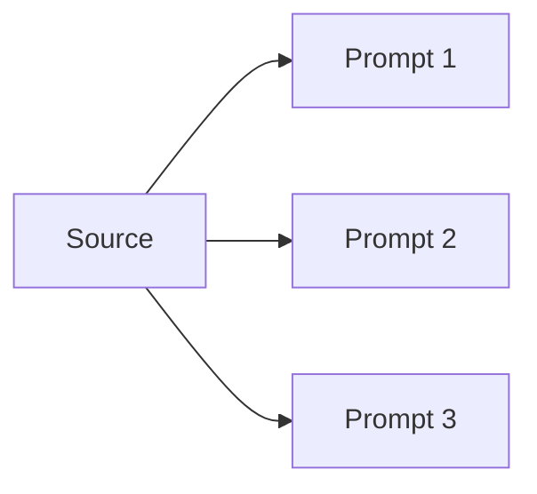
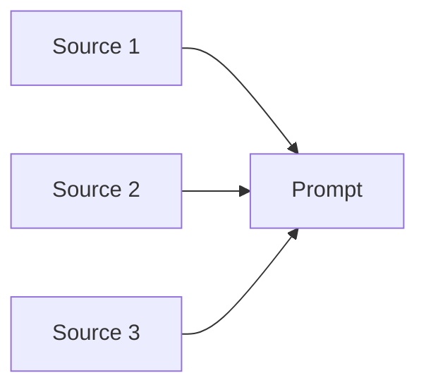
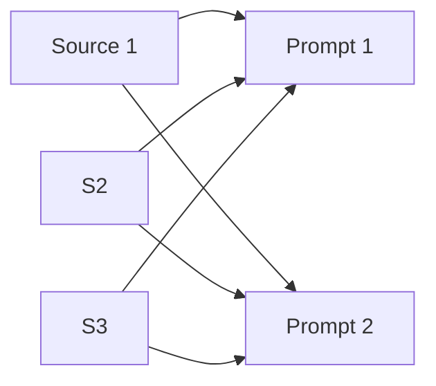

# Concepts

Pollux is an orchestration layer for multimodal LLM analysis. You describe
what to analyze; Pollux handles source patterns, context caching, concurrency,
retries, and result normalization.

## The Pipeline

Every call follows four phases:

**Request** — Validates and normalizes prompts, sources, config, and options
into a canonical representation.

**Plan** — Converts the request into deterministic API calls and computes
cache keys from content hashes.

**Execute** — Uploads content, reuses cached context where possible, and runs
provider calls concurrently.

**Extract** — Transforms API responses into a stable
[`ResultEnvelope`](sources-and-patterns.md#resultenvelope-reference) with
`answers`, optional `structured` data, and `usage` metadata.

This separation lets Pollux support multimodal inputs and provider differences
without forcing callers to reimplement orchestration logic.

## Source Patterns

Source patterns describe the relationship between sources and prompts. Pollux
supports three:

### Fan-out: one source, many prompts

Upload one artifact and ask many questions about it. This is the strongest
fit for context caching — the source is uploaded once and reused for every
prompt.

### Fan-in: many sources, one prompt

Synthesize across multiple artifacts with a single question. The prompt
stays stable while sources vary, keeping comparisons objective.

### Broadcast: many sources, many prompts

Apply the same analysis template across multiple sources. Consistent prompts
make output comparison and post-processing straightforward.

## Context Caching

Without caching, repeated prompts resend the same large context every time.
With caching, Pollux uploads content once and reuses it — savings compound
with each additional prompt.

Caching is provider-dependent (Gemini-only in v1.0). For mechanics, TTL
tuning, and token economics, see
[Caching and Efficiency](caching-and-efficiency.md).

## Capability Transparency

Pollux does not hide provider differences behind silent fallbacks. Supported
features run normally; unsupported combinations fail fast with a clear
`ConfigurationError` or `APIError`. This keeps behavior legible in both
development and production.

See the full matrix at
[Provider Capabilities](reference/provider-capabilities.md).

## What You Own vs What Pollux Owns

**You own:** prompt intent, source selection, model/provider choice, and
domain-specific output validation.

**Pollux owns:** orchestration mechanics, cache identity and reuse, retry
and concurrency control, and the normalized result envelope.
