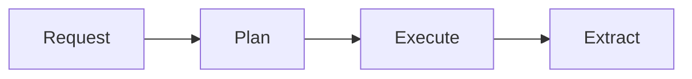
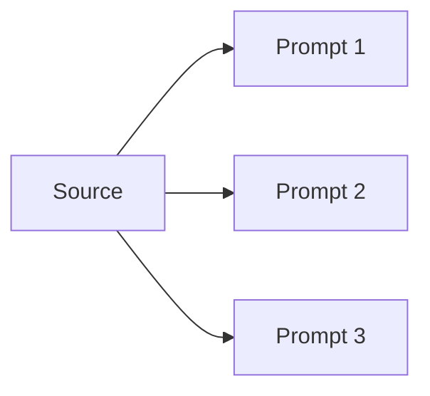
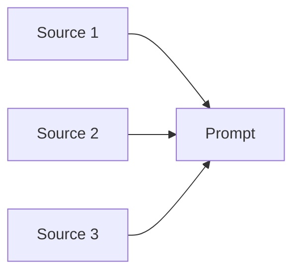
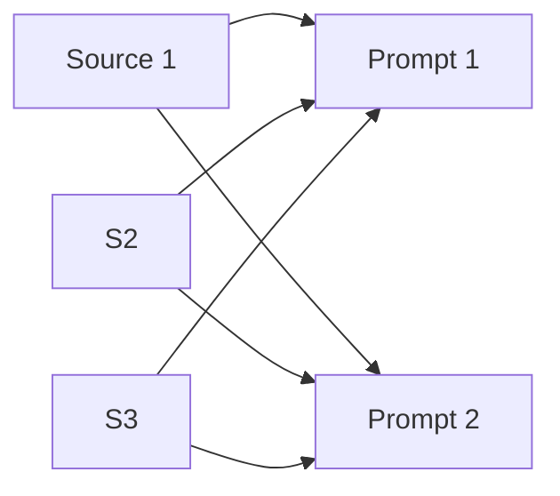

<!-- Intent: Establish the mental model for LLM orchestration through
     Pollux's lens. Teach domain concepts (multimodal inputs, structured output,
     tool calling, multi-turn, caching, source patterns, reasoning) BEFORE
     showing any Pollux API. Then introduce Pollux's four-phase pipeline and
     the ownership boundary table. Do NOT include runnable code examples or
     hands-on tutorials — those belong in subsequent pages. Assumes no prior
     LLM API experience. Register: conceptual/declarative. -->

# Core Concepts

Before diving into Pollux's API, it helps to understand the LLM ecosystem
concepts that shape its design. This page explains those concepts first, then
shows how Pollux implements them.

## What Is LLM Orchestration?

Large language models (LLMs) accept input and generate output. At the API
level, every interaction follows the same fundamental cycle: you send a
**prompt** (your question or instruction) along with optional **context**
(documents, images, audio, video), and the model returns a **completion**
(its response). This prompt-completion cycle is the building block of
everything that follows.

### Multimodal Inputs

Modern LLMs are not text-only. A **multimodal** model can process PDFs,
images, video frames, and audio alongside text. Sending multimodal content
through an API requires uploading or referencing binary data, specifying
MIME types, and handling provider-specific encoding — all of which adds
complexity to what would otherwise be a prompt-completion call.

### Structured Outputs

By default, models return free-form text. **Structured output** constrains the
model's response to match a JSON schema you provide, producing typed data
instead of prose. This turns model output into something your code can parse,
validate, and store without regex or string manipulation.

### Tool Calling

Models can request actions from your code mid-conversation. When **tool
calling** is enabled, the model may respond not with text but with a request
to invoke a named function (e.g., "call `get_weather` with `location=NYC`").
Your code executes the function, returns the result, and the model incorporates
it into its next response. This is the foundation of agent loops.

Tool calling follows a cooperative model: the model *proposes* actions, and
your code *disposes* of them. The interaction has three stages:

1. **Definition** — you declare tool schemas (name, description, parameters)
   alongside the prompt.
2. **Call request** — the model responds with a structured tool-call object
   instead of (or alongside) text.
3. **Result return** — your code executes the function and feeds the output
   back as a tool-result message for the next turn.

This boundary is what makes agent loops safe: the model never executes code
directly. It can only ask, and your code decides whether and how to comply.

### Multi-Turn Conversations

A single prompt-completion exchange is stateless. **Multi-turn conversations**
maintain context across exchanges by passing conversation history — previous
user messages, assistant responses, and tool results — back to the model with
each new prompt. The model itself stores nothing between calls; your code (or
your orchestration layer) is responsible for carrying state forward.

Because the full history is sent with every turn, the token cost of a
conversation grows with each exchange. A 20-turn conversation re-sends the
first 19 turns every time. Managing this growth — through truncation,
summarization, or selective inclusion — is an application-level concern, not
something the model or the orchestration layer handles automatically.

### Context Caching

When you ask multiple questions about the same document, the naive approach
re-uploads the entire document with each prompt. **Context caching** uploads
content once and assigns it a reference that subsequent calls can reuse —
avoiding redundant data transfer and reducing token costs proportionally.

The economics are straightforward: providers charge per input token, and
multimodal content (video, long PDFs, image sets) can consume hundreds of
thousands of tokens. Without caching, a fan-out workload with 10 prompts on a
1-hour video pays for the video's tokens 10 times. With caching, it pays once
for the upload and a smaller reference cost per subsequent call.

At the API level, caching works by replacing raw content with a content
reference — a provider-assigned identifier that points to previously uploaded
data. Cache identity is typically keyed on the content hash, so renaming a
file or changing the prompt does not invalidate the cache; only changing the
content itself does.

### Source Patterns

When analysis scales beyond a single prompt and source, three structural
patterns emerge:

- **Fan-out** — one source, many prompts. Upload an artifact once, ask
  multiple questions about it.
- **Fan-in** — many sources, one prompt. Synthesize across multiple artifacts
  with a single question.
- **Broadcast** — many sources, many prompts. Apply the same analysis template
  across multiple sources.

These patterns describe the *shape* of work, not the implementation. An
orchestration layer can optimize for each shape differently (reusing uploads
in fan-out, parallelizing calls in broadcast).

### Reasoning Modes

Some models support explicit **reasoning** — an extended thinking phase before
generating a response. When enabled via an effort control, the model's internal
reasoning trace may be returned alongside the answer, allowing you to audit
how it arrived at its conclusions. Support for reasoning varies by model
family and provider.

---

## Pollux's Pipeline

Pollux implements these concepts through a four-phase pipeline:

**Request** — Validates and normalizes prompts, sources, config, and options
into a canonical representation.

**Plan** — Converts the request into deterministic API calls and computes
cache keys from content hashes.

**Execute** — Uploads content, reuses cached context where possible, and runs
provider calls concurrently.

**Extract** — Transforms API responses into a stable
[`ResultEnvelope`](sending-content.md#resultenvelope-reference) with
`answers`, optional `structured` data, and `usage` metadata.

This separation lets Pollux support multimodal inputs and provider differences
without forcing callers to reimplement orchestration logic.

### Source Patterns in Pollux

Pollux expresses source patterns through its two entry points, `run()` and
`run_many()`:

#### Fan-out: one source, many prompts

Upload one artifact and ask many questions about it. This is the strongest
fit for context caching — the source is uploaded once and reused for every
prompt.

#### Fan-in: many sources, one prompt

Synthesize across multiple artifacts with a single question. The prompt
stays stable while sources vary, keeping comparisons objective.

#### Broadcast: many sources, many prompts

Apply the same analysis template across multiple sources. Consistent prompts
make output comparison and post-processing straightforward.

## Where Pollux Ends and You Begin

Pollux is an orchestration layer, not a framework. It handles the mechanics
of getting content to a model and results back to you, but deliberately
leaves domain-level decisions and workflow orchestration to your code.

| Responsibility | You Own | Pollux Owns |
|---|---|---|
| **Prompts** | Writing and iterating on prompt text | Delivering prompts to the provider |
| **Sources** | Choosing what to analyze and when | Uploading, caching, and attaching sources to calls |
| **Models** | Selecting the provider and model | Provider-specific API translation |
| **Tool execution** | Implementing and calling tools | Surfacing tool-call requests and passing results back |
| **Multi-turn loops** | Loop control, exit conditions, state | Single-turn request/response with conversation continuity |
| **Result aggregation** | Collecting, comparing, and storing answers | Normalizing each response into `ResultEnvelope` |
| **Error recovery** | Deciding what to retry or skip at the workflow level | Retrying transient API failures within a single call |
| **Concurrency** | Parallelizing across files or workflows | Concurrent API calls within a single `run_many()` |
| **Output validation** | Domain-specific checks on answers | Structured parsing via `response_schema` |

This boundary is intentional. By keeping workflow orchestration in your code,
Pollux avoids imposing opinions about loop structures, error policies, or
aggregation formats that vary across use cases.

---

Now that you have the mental model, see
[Sending Content to Models](sending-content.md) to start using the API — create
sources, call `run()`, and read results.
