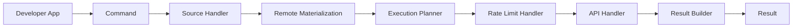
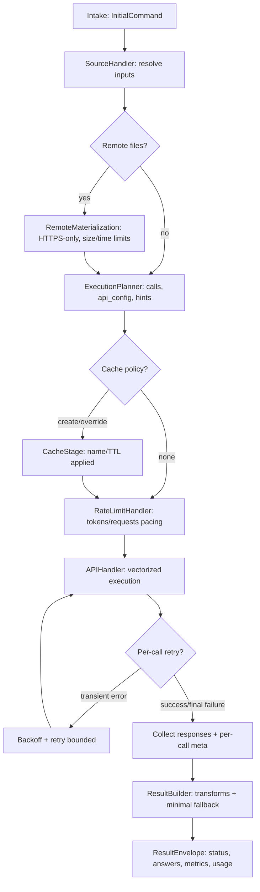

# Pollux Architecture – At a Glance

> Status: Target architecture. Some components still map to legacy classes on this branch. The new token estimation system is implemented on a separate branch; see Related Docs.
>
> Audience: Contributors and advanced users.
> Prerequisites: Familiarity with the project structure and basic async Python.

## Purpose

Provide developer-consumers with a predictable, testable, and extensible way to run batched Gemini API calls at scale. The architecture is designed for clarity, composability, and performance.

---

## Key Principles

- **Radical Simplicity** – Even advanced features should feel obvious in retrospect.
- **Explicit over Implicit** – No hidden state or “magic”; data and control flow are transparent.
- **Data-Centricity** – Complex state lives in rich, immutable objects; transformations are simple and stateless.
- **Architectural Robustness** – Invalid states are structurally impossible.
- **Superior Developer Experience** – Components are isolated, testable, and easy to extend.

---

## Primary Pattern – Command Pipeline

The Command Pipeline is an **asynchronous, unidirectional series of stateless handlers** that transform a request from raw inputs into a final, enriched result.

**Flow:**

```text
Command → Source Handler → Execution Planner → API Handler → Result Builder → Result
```

---

## Core Components

- **Command** – Immutable description of the request (sources, prompts, configuration)
- **Source Handler** – Resolves and normalizes raw inputs
- **Execution Planner** – Makes strategic decisions (token budgeting, caching, batching, prompt assembly)
- **API Handler** – Executes the plan via provider adapter(s) and errors
- **Rate Limit Handler** – Enforces vendor-neutral request/token pacing prior to API execution
- **Result Builder** – Parses output, validates schema, merges telemetry, calculates metrics
- **Executor** – Orchestrates handlers in order

---

## Why This Architecture

Replaces earlier monolithic design (`BatchProcessor` + `GeminiClient`) that had:

- Hidden sequencing
- Mixed responsibilities
- Synchronous bottlenecks
- Hard-to-extend decision logic

The pipeline separates concerns, enforces state validity, and enables async-first scalability.

---

## Quality Attributes

- **Testability** – Handlers testable in isolation
- **Extensibility** – Add steps without touching existing ones
- **Robustness** – Type system enforces valid transitions
- **Transparency** – Pipeline structure is clear and predictable

---

## Diagram

Alt: High-level pipeline flow from user command through handlers (Source Handler → Remote Materialization → Execution Planner → Rate Limit Handler → API Handler → Result Builder) to a final Result.



### Handler roles at a glance

- Source Handler: Normalize raw inputs into structured `Source` data.
- Execution Planner: Decide batching, caching, token budgeting, and prompt assembly.
- Rate Limit Handler: Enforce vendor-neutral pacing before API execution.
- API Handler: Execute the plan (uploads, caching, retries, provider SDK calls).
- Result Builder: Parse output, validate schemas, and merge telemetry/metrics.

---

## Lifecycle (states & retries)

Alt: Detailed state diagram of handler transitions and retry loop: intake → source resolution → optional remote materialization → planning → optional cache stage → rate limiting → API execution with bounded retries → result building → envelope with metrics.



Notes:

- Telemetry: Each stage emits scoped timings and counters when enabled; failures never break the pipeline.
- Safety: Remote materialization is opt-in and HTTPS-only by default; ephemeral files are cleaned up post-upload.
- Concurrency: API handler respects client-side semaphore; metrics include per-call `api_time_s` and `non_api_time_s`.

---

## Related Docs

- [Concept – Command Pipeline](./concepts/command-pipeline.md)
- [Deep Dive – Command Pipeline Spec](./deep-dives/command-pipeline-spec.md)
- [Decisions Directory (ADRs & Briefs)](./decisions/index.md)
- [ADR-0001 – Command Pipeline](./decisions/ADR-0001-command-pipeline.md)
- [ADR-0011 – Cache Policy & Planner Simplification](./decisions/ADR-0011-cache-policy-and-planner-simplification.md)
- [Architecture Rubric](./architecture-rubric.md)
- [Concept – Token Counting & Estimation](./concepts/token-counting.md)
- [Glossary](./glossary.md)
