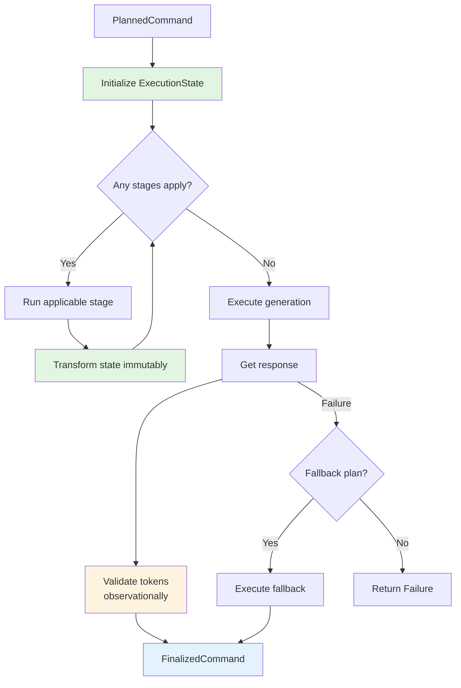

# API Execution Pattern — Conceptual Overview

> Status: Implemented. This pattern governs how the pipeline executes API calls against provider SDKs.
>
> Audience: Contributors and advanced users.
> Prerequisites: Familiarity with the Command Pipeline pattern and immutable data flow.

## Purpose & Scope

The API Execution Pattern defines how `ExecutionPlan` objects are translated into actual provider API calls while maintaining the pipeline's architectural principles. It ensures provider-specific logic remains isolated, execution state stays immutable, and observability remains orthogonal.

**In scope**:

- Pure execution state model
- Capability-based provider abstraction
- Self-limiting execution stages
- Orthogonal telemetry collection
- Fallback execution patterns

**Not in scope**:

- Provider SDK installation/configuration
- Specific provider API details
- Real-time streaming responses
- Multi-turn conversation management (see Conversation extension)

---

## Problem Statement

The API Handler must execute plans against diverse provider SDKs (Gemini, OpenAI, Anthropic) while:

- **Maintaining immutability** — no in-place mutation of command objects
- **Isolating provider differences** — SDK specifics don't leak into core pipeline
- **Supporting optional capabilities** — not all providers support uploads/caching
- **Enabling extensibility** — new providers and capabilities without core changes
- **Preserving testability** — execution logic testable without real SDKs

Traditional approaches either:

- Tightly couple to specific SDKs (poor extensibility)
- Use complex inheritance hierarchies (poor clarity)
- Mix concerns like telemetry with execution (poor separation)

---

## Core Pattern

The API Handler follows a **pure execution flow** through **capability-aware stages**. In the current implementation, purity is achieved with immutable inputs and local variables rather than a named `ExecutionState` class, preserving the same guarantees with less ceremony.

```text
ExecutionState → [Upload Stage?] → [Cache Stage?] → [Generation Stage] → FinalizedCommand
                     ↓                   ↓                ↓
                  (if needed)        (if needed)     (always runs)
```

Each stage:

1. Checks if it applies to the current state
2. Verifies provider has required capabilities
3. Transforms state immutably
4. Returns new state for next stage

---

## Conceptual Components

### Pure Execution State (conceptual)

Conceptually, execution state contains only execution-relevant information (plan, effective parts, optional cache reference) and explicitly excludes telemetry and errors. The current code maintains this purity without materializing a separate state object, favoring radical simplicity.

### Provider Capabilities

Fine-grained protocols declaring what operations a provider supports:

- `GenerationCapability` — Core generation (required)
- `UploadsCapability` — File upload support (optional)
- `CachingCapability` — Context caching (optional)

Providers implement only the capabilities they support. The type system prevents calling unsupported operations.

### Self-Limiting Stages

Execution stages that actively refuse work outside their scope:

- Check preconditions via `applies_to(state)`
- Verify provider capabilities at runtime
- Skip gracefully if not applicable
- Fail explicitly if required but unsupported

### Orthogonal Telemetry

Telemetry collection completely separate from execution flow:

- Context managers measure operations
- Collectors accumulate metrics
- No pollution of execution state
- Easy to disable or replace

Implementation note: Telemetry is attached to `FinalizedCommand` and surfaced by `ResultBuilder`. Stage durations are recorded for all handlers, including `ResultBuilder`.

---

## Design Principles

### Principle 1: State Purity

Execution state contains only data needed for execution. Side effects (telemetry, logging) happen orthogonally.

### Principle 2: Capability Declaration

Providers explicitly declare capabilities via protocol implementation. Runtime checks ensure safety.

### Principle 3: Stage Self-Limitation

Stages know their narrow responsibility and refuse work outside it. No responsibility creep.

### Principle 4: Fail-Fast with Fallback

Primary failures trigger explicit fallback execution if specified. No silent retries or hidden recovery.

---

## Flow Diagram



---

## Quality Attributes

### Testability (5/5)

- Pure state transformations easily tested
- Stages testable in isolation
- Mock adapter for deterministic tests
- No hidden dependencies

### Extensibility (5/5)

- New providers via adapter + capabilities
- New stages via ExecutionStage protocol
- New part types (ConversationPart, etc.)
- Capability-based feature detection

### Robustness (5/5)

- Type system prevents invalid operations
- Capabilities checked at runtime
- Immutable state prevents corruption
- Explicit error propagation

### Clarity (5/5)

- Linear state transformation
- Explicit capability requirements
- Self-documenting stage conditions
- Clear separation of concerns

---

## Integration Points

### With Planner

The planner creates `ExecutionPlan` objects that drive API execution:

- Decides which parts to include
- Specifies upload tasks
- Determines caching strategy
- Provides fallback plans

### With Result Builder

The result builder consumes `FinalizedCommand` objects:

- Extracts response text/data
- Validates against schemas
- Calculates final metrics
- Merges telemetry data

### With Extensions

Extensions add specialized behavior:

- Conversation history as parts
- Streaming response handling
- Custom retry policies
- Provider-specific optimizations

---

## Examples

### Basic Generation

```python
# Simplest case - no uploads, no caching
state = ExecutionState(
    plan=plan,
    parts=(TextPart(text="Hello"),)
)
# No stages apply, straight to generation
response = await provider.generate(...)
```

### With Upload and Cache

```python
# Complex case - upload, then cache, then generate
state = ExecutionState(
    plan=plan_with_uploads_and_cache,
    parts=(TextPart(text="Analyze"), FilePlaceholder(index=0))
)
# Upload stage runs → substitutes file reference
# Cache stage runs → creates cache
# Generation uses cached context
```

### Provider Without Upload Support

```python
# OpenAI adapter - no upload capability
state = ExecutionState(
    plan=plan_with_uploads,
    parts=(TextPart(text="..."),)
)
# Upload stage checks capability → skips
# Generation runs with original parts
# Or fails if uploads were required
```

---

## Related Documents

- [Deep Dive — API Handler Spec](../deep-dives/api-handler-spec.md)
- [Concept — Provider Capabilities](./provider-capabilities.md)
- [ADR-0003 — API Handler Architecture](../decisions/ADR-0003-api-handler.md)
- [How-to — Adding Provider Adapters](../../how-to/provider-adapters.md)
