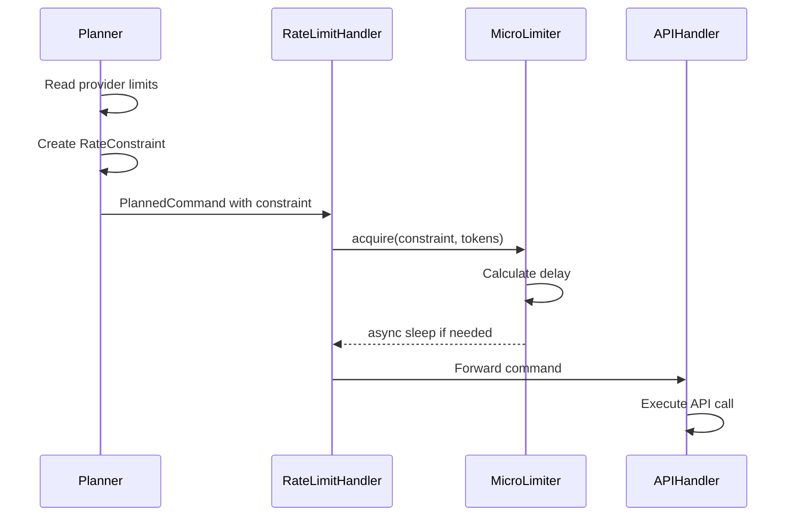

# Rate Limiting — Conceptual Overview

> Status: Target architecture. Vendor-neutral rate limiting via middleware pattern.
>
> Audience: Contributors and advanced users.
> Prerequisites: Familiarity with Command Pipeline architecture.

## Purpose

Rate limiting protects against API quota exhaustion and 429 errors while maintaining high throughput. The architecture provides vendor-neutral enforcement with clean provider extension points.

This design replaces earlier monolithic rate limiting embedded in `GeminiClient` with a **composable middleware handler** that enforces limits as pure data constraints.

---

## Guiding Principles

- **Data over behavior** — Rate limits are immutable data in `RateConstraint`, not stateful objects
- **Vendor neutrality** — Core enforces limits; providers supply them
- **Explicit timing** — No hidden sleeps or retries outside designated handlers
- **User sovereignty** — Users can override any limit via configuration
- **Single responsibility** — Rate limiting separated from API execution

---

## Core Pattern

Rate limiting operates as a **pipeline handler** that enforces constraints before API execution:

```text
Command → Source → Planning → Rate Limit Handler → API Execution → Result
                                   ↓
                         RateConstraint enforcement
```

---

## Conceptual Components

### RateConstraint

Immutable data describing rate limits:

- Requests per minute
- Tokens per minute (optional)
- Burst allowance
- Minimum interval between requests

### RateLimitHandler

Stateless handler that:

- Extracts constraints from ExecutionPlan
- Maintains micro-limiters per (provider, model, tier)
- Enforces timing via async delays
- Emits telemetry for observability

### Micro-Limiter

Minimal timing enforcer:

- Tracks last request time
- Calculates required delay
- Uses monotonic clock for reliability
- No cross-command state

### Provider Integration

Providers supply limits via:

- Static data in `core.models`
- Optional `RateLimitCapability` protocol
- User configuration overrides

---

## Data Flow

1. **Planning Phase**: Planner reads provider limits, creates `RateConstraint`
2. **Enforcement Phase**: RateLimitHandler applies constraint via micro-limiters
3. **Execution Phase**: APIHandler proceeds after rate limit cleared
4. **Telemetry Phase**: Wait times and enforcement metrics emitted

---

## Quality Attributes

- **Testability** — Pure timing logic with injectable clock
- **Extensibility** — New providers add data, not code
- **Robustness** — Monotonic time prevents clock issues
- **Transparency** — Limits visible in plan and telemetry
- **Performance** — Minimal overhead; single async delay per request

---

## Relationship to Legacy Architecture

Previous design (`RateLimiter` in `client/rate_limiter.py`):

- Embedded in `GeminiClient`
- Stateful deque of timestamps
- Synchronous sleeps
- No token tracking
- Hard to test (time-dependent)

New design:

- Separate handler in pipeline
- Minimal state (last request time)
- Async delays
- Optional token limiting
- Trivial to test (injectable time)

---

## Diagram



---

## Related Documents

- [Deep Dive — Rate Limiting Spec](../deep-dives/rate-limiting-spec.md)
- [ADR-0004 — Rate Limiting Pattern](../decisions/ADR-0004-rate-limiting.md)
- [Architecture at a Glance](../architecture.md)
