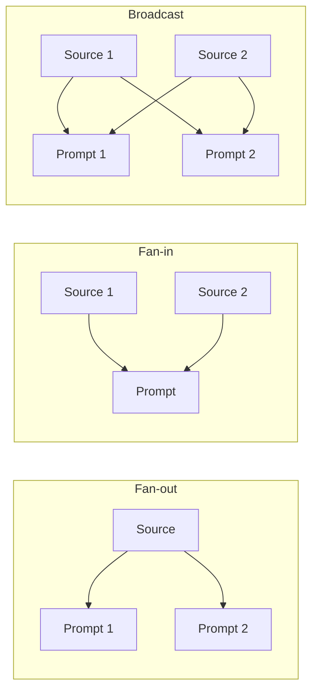

<!-- Intent: Teach collection-level analysis workflows using source patterns
     (fan-out, fan-in, broadcast). Show the two-level loop pattern (your outer
     loop + Pollux's inner call). Do NOT cover structured output, tool calling,
     or caching mechanics — link to those pages. Assumes the reader understands
     run() and run_many() from Sending Content. Register: guided applied. -->

# Analyzing Collections with Source Patterns

You have a directory of files and want to run the same analysis across all of
them, or synthesize across multiple sources, or both. This page shows how
to structure that work. Pollux handles each file's API calls. Your code owns
iteration, concurrency, and aggregation.

Source patterns describe the relationship between sources and prompts:



- **Fan-out:** one source, many prompts. Upload an artifact once, ask
  multiple questions. Context caching pays off here.
- **Fan-in:** many sources, one prompt. Synthesize across artifacts with a
  single question. Useful for comparisons and cross-document analysis.
- **Broadcast:** many sources × many prompts. Apply the same analysis
  template across a collection. Consistent prompts make output comparison
  predictable.

!!! info "Boundary"
    **Pollux owns:** source upload, context caching, concurrent API calls
    within a single `run_many()`, retries, and result normalization.

    **You own:** file discovery, the outer iteration loop, cross-file
    concurrency, result aggregation, and partial-failure decisions.

## Processing a Collection

The pattern is a two-level loop:

- **Outer loop (your code):** iterates over files, controls concurrency
  across files, and collects results.
- **Inner call (Pollux):** `run()` or `run_many()` handles one file's
  prompts, uploads, caching, and concurrent API calls.

Process all PDFs in a directory, ask two questions about each, and collect
results into a summary dictionary:

```python
import asyncio
from pathlib import Path

from pollux import Config, Options, Source, run_many

config = Config(provider="gemini", model="gemini-2.5-flash-lite")

PROMPTS = [
    "What is the main argument of this document?",
    "List the key findings as bullet points.",
]


async def analyze_file(path: Path) -> dict:
    """Analyze a single file with multiple prompts."""
    source = Source.from_file(str(path))
    result = await run_many(
        PROMPTS,
        sources=(source,),
        config=config,
    )
    return {
        "file": path.name,
        "status": result["status"],
        "main_argument": result["answers"][0],
        "key_findings": result["answers"][1],
        "tokens": result["usage"]["total_tokens"],
    }


async def process_directory(directory: str) -> list[dict]:
    """Process all PDFs in a directory and return summaries."""
    pdf_dir = Path(directory)
    pdf_files = sorted(pdf_dir.glob("*.pdf"))

    if not pdf_files:
        print(f"No PDFs found in {directory}")
        return []

    results = []
    for path in pdf_files:
        try:
            summary = await analyze_file(path)
            results.append(summary)
            print(f"  {path.name}: {summary['status']} ({summary['tokens']} tokens)")
        except Exception as exc:
            print(f"  {path.name}: FAILED — {exc}")
            results.append({"file": path.name, "status": "error", "error": str(exc)})

    succeeded = sum(1 for r in results if r["status"] == "ok")
    print(f"\nProcessed {len(results)} files: {succeeded} ok, {len(results) - succeeded} failed")
    return results


asyncio.run(process_directory("./papers"))
```

### Step-by-Step Walkthrough

1. **Define stable prompts.** `PROMPTS` is a module-level list of questions
   applied to every file. Keeping prompts constant across files makes output
   comparison and post-processing predictable.

2. **Write `analyze_file`.** This function wraps a single file as a `Source`
   and calls `run_many()` with the shared prompts. Pollux handles upload,
   concurrent API calls, and result normalization within this call.

3. **Iterate in the outer loop.** `process_directory` discovers files and calls
   `analyze_file` for each one. The outer loop owns file discovery, ordering,
   and result aggregation, concerns Pollux deliberately leaves to your code.

4. **Handle failures per file.** Each `analyze_file` call is wrapped in a
   try/except. A bad PDF or a rate-limit exhaustion skips one file without
   aborting the entire run.

That's the complete pattern. You wrote the outer loop. Pollux handled the
API calls within each iteration. The result is a structured summary per file.
Every variation below builds on this same two-level structure.

## Fan-in: Synthesizing Across Sources

The examples above analyze each file independently. But what if your question
is about the collection as a whole? Pass multiple sources to a single prompt:

```python
async def synthesize_collection(directory: str, question: str) -> str:
    """Ask one question about multiple sources together."""
    pdf_files = sorted(Path(directory).glob("*.pdf"))
    sources = tuple(Source.from_file(str(p)) for p in pdf_files)

    result = await run_many(
        question,
        sources=sources,
        config=config,
    )
    return result["answers"][0]
```

This sends all sources to the model in one call. Useful for comparative
questions: "Which paper has the strongest methodology?" or "What themes
appear across all documents?"

For structured comparisons with typed output (similarities, differences,
strengths), combine fan-in with a `response_schema`. See
[Extracting Structured Data](structured-data.md).

## Concurrent File Processing

Process multiple files in parallel while limiting concurrency to avoid
overwhelming the API:

```python
CONCURRENCY = 3

async def process_directory_concurrent(directory: str) -> list[dict]:
    """Process files concurrently with bounded parallelism."""
    pdf_dir = Path(directory)
    pdf_files = sorted(pdf_dir.glob("*.pdf"))
    semaphore = asyncio.Semaphore(CONCURRENCY)

    async def bounded_analyze(path: Path) -> dict:
        async with semaphore:
            try:
                return await analyze_file(path)
            except Exception as exc:
                return {"file": path.name, "status": "error", "error": str(exc)}

    return await asyncio.gather(*(bounded_analyze(p) for p in pdf_files))
```

Pollux already limits concurrent API calls *within* each `run_many()` via
`Config.request_concurrency`. The semaphore here controls how many *files*
are processed simultaneously (a separate concern). Start conservative (2-4
concurrent files) and ramp up until reliability drops.

## Writing Results to JSONL

Stream results to a JSONL file for downstream processing:

```python
import json

async def process_to_jsonl(directory: str, output: str) -> None:
    """Process all PDFs and write results as JSONL."""
    pdf_files = sorted(Path(directory).glob("*.pdf"))

    with open(output, "w") as f:
        for path in pdf_files:
            try:
                summary = await analyze_file(path)
            except Exception as exc:
                summary = {"file": path.name, "status": "error", "error": str(exc)}
            f.write(json.dumps(summary) + "\n")

    print(f"Wrote {len(pdf_files)} results to {output}")
```

## What to Watch For

- **Fan-out per file vs. fan-in across files.** The complete example uses
  fan-out (one file, many prompts). The fan-in variation reverses that.
  Pick based on whether your question targets individual files or the
  collection as a whole.
- **Semaphore vs `request_concurrency`.** Pollux's `request_concurrency`
  controls API calls within a single `run_many()`. Your semaphore controls
  how many files process simultaneously. Both matter for rate limits.
- **Partial failures are normal.** Large collections will hit occasional
  failures: bad PDFs, exhausted rate limits, timeouts. Design
  your aggregation to handle `status: "error"` entries. See
  [Handling Errors and Recovery](error-handling.md) for production patterns.
- **Memory with large collections.** Each `Source.from_file()` reads the
  file for hashing. For very large collections, process in batches rather
  than loading all sources at once.
- **Caching helps fan-out, not iteration.** `enable_caching=True` saves
  tokens when the *same source* gets reused across multiple prompts. It
  does not help when each file is different. See
  [Reducing Costs with Context Caching](caching.md).

---

To get typed objects from your collection analysis instead of free-form text,
see [Extracting Structured Data](structured-data.md). To reduce token costs
when reusing the same sources across prompts, see
[Reducing Costs with Context Caching](caching.md).
